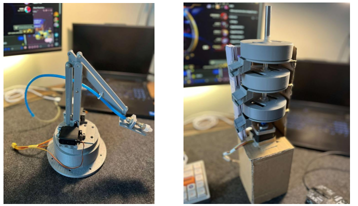

# 🤖 ARM ROBOT - Automatic Pill Dispensing System

An automated robotic system designed for pharmaceutical storage and distribution. Based on the STM32 microcontroller platform and precise actuation mechanisms, this system receives user commands, locates the correct medication, and dispenses it efficiently, safely, and accurately.

## 🎯 Project Objectives

- Design a smart robotic arm capable of automated pill picking and dispensing.
- Communicate with users via UART and a custom WinForm GUI.
- Monitor environmental conditions for safe drug storage.
- Apply embedded systems, sensors, and control programming in a real-world application.

## ⚙️ Technologies & Components

| Component                | Purpose                                         |
|--------------------------|--------------------------------------------------|
| STM32F103C8T6            | Main microcontroller unit                        |
| Servo MG996R             | Controls arm movement (multi-axis)              |
| Stepper motor + driver   | Rotates the circular drug tray                  |
| Vacuum pump              | Picks up and transfers pills                    |
| DHT11 sensor             | Measures temperature and humidity               |
| LCD 1602 (I2C)           | Displays real-time data                         |
| 5V Relay Module          | Switches vacuum pump                            |
| WinForm GUI (UART)       | User interface for control and monitoring       |

## 🧠 How It Works

1. The user selects pill type and quantity via GUI.
2. Data is transmitted to STM32 via UART.
3. The robot calculates positions and moves the arm accordingly.
4. Relay activates the pump to pick the pill.
5. Stepper motor rotates the tray to the correct position.
6. Process status is shown on the LCD and sent back to the GUI.

## 🛠️ System Design Overview

### 🔩 Robotic Arm:
- Built with parallel and four-bar linkage mechanism.
- Controlled along 3 axes: X (horizontal), Y (vertical), Z (rotation).

### 💊 Pill Dispensing Tray:
- Circular rotating tray with compartments.
- Designed for easy access by the robotic arm.

## 🖥️ User Interface (WinForm)

- Communicates over UART at 115200bps.
- Allows selection of pill type (e.g., A, B, C...) and quantity.
- Displays connection status, transmission logs, and STM32 responses.
- Alerts for format errors or connection failures.

## 🌡️ Environmental Monitoring

- Temperature and humidity are read using a DHT11 sensor.
- Values are displayed in real time on the LCD.
- Ensures optimal conditions for medication preservation.

## ✅ Project Outcomes

- Prototype of the robotic arm and dispensing station completed.
- Stable UART communication and responsive control.
- User-friendly GUI suitable for real-world application.
- Demonstrated potential for use in pharmacies, hospitals, and smart storage.

## 🚀 Future Improvements

- Integrate camera + AI for pill recognition.
- Add distance sensors for more precise positioning.
- IoT connectivity for remote drug management.
- Advanced prescription management software integration.

## 🗂️ Project Structure

```
├── Core/
│   ├── main.c
│   ├── lcd_i2c.c
│   ├── uart.c
│   └── ...
├── GUI_Winform/
│   └── PharmacyRobotGUI.sln
├── Docs/
│   └── Final_Report.pdf
├── README.md
└── ...
```

## 📦 Requirements

- STM32CubeIDE (or Keil uVision)
- Visual Studio (.NET Framework) for GUI
- CH340 USB-UART driver
- Breadboard, jumper wires, 12V power supply

> The Automatic Pill Dispensing Robot is a foundational step toward modernizing pharmaceutical logistics. It increases efficiency, minimizes human error, and enhances healthcare service quality.

